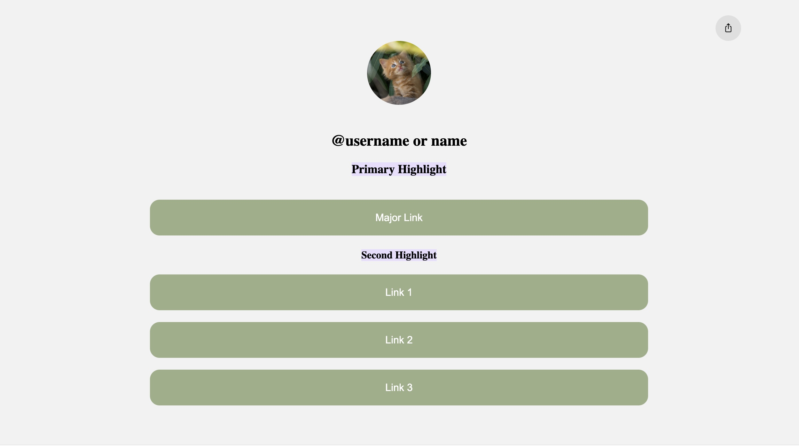
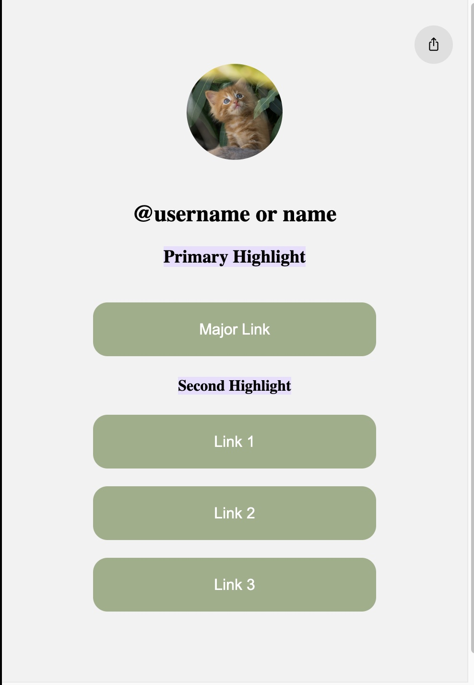

# linker-er 🔗
## Linktree Alternative

### Fast - Responsive - Aesthetic

#### A fun side project to make a simple link tree alternative.

 

     

 

## Desktop:

## Mobile:

## Notes:
---
- I know this misses a lot of feautres like Analytics
- Images
- Cool Background customisability
- themes

## Contributing
---
Feel free to add any of the above missing features or your own!

